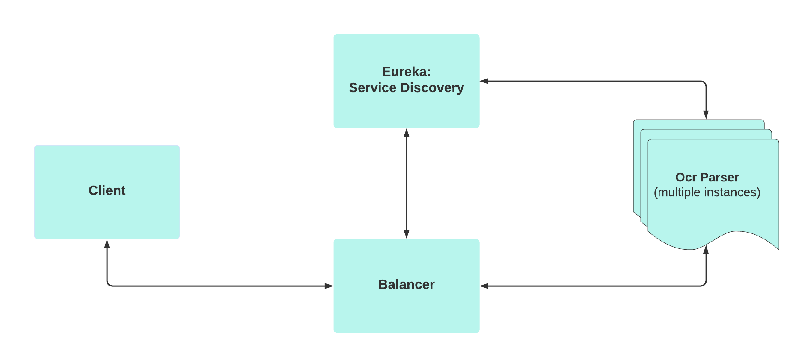

# Ms Phone Parser

Simple app which help with validation during ms products installation. Features:

* read clipboard screenshot data
* parser to ocr
* validate code
* generate JS script to use on ms site to register code

App consists of 4 module microservices:

- client (angular)
- load balancer
- service discovery server: eureka
- ocr parser

### Chart



### Stack used

* java 17
* tesseract4j
* spring boot: web, cloud
* angular 13

## Deploy

1. Got to main folder ms-phone-validator
2. Run commands below:

```
./mvnw clean install
 docker-compose build
 docker-compose up --scale ocr-parser=<number of instances>
```
